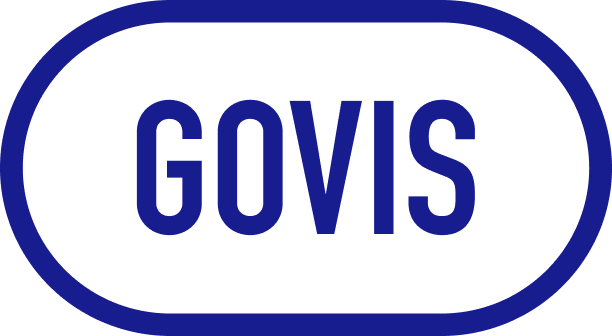

# GOVIS - 백오피스 리뉴얼

GOVIS는 고피자(GOPIZZA) 본사 임직원들을 위한 매출 분석, 제품/메뉴 및 매장 관리 등을 내부 서비스 백오피스 시스템입니다. 이 프로젝트는 기존 백오피스 시스템을 현대적인 기술 스택과 UI/UX로 리뉴얼한 버전입니다.

<!--  -->

## 프로젝트 개요

- **명칭**: GOVIS
- **유형**: 백오피스 웹 애플리케이션
- **목적**: 고피자 본사 임직원의 업무 효율화 및 데이터 분석 지원
- **대상 사용자**: 고피자 본사 임직원
- **주요 기능**: 
  - 대시보드
  - AI 기반 분석 및 모니터링 (AISTT)
  - 제품 및 메뉴 관리
  - 매출 분석
  - 매장 판매 데이터 관리
  - 각종 리포트 생성

## 설치 방법

### 필수 요구사항
- Node.js 14.0.0 이상
- Yarn 패키지 매니저

### 설치 과정

1. 저장소를 클론합니다:
```bash
git clone [저장소 URL]
cd GovisBackOfficeRenewal
```

2. 의존성을 설치합니다:
```bash
yarn install
```

3. 개발 서버를 실행합니다:
```bash
yarn dev
```

4. 브라우저에서 [http://localhost:3000](http://localhost:3000)으로 접속하여 애플리케이션을 확인합니다.

## 사용 방법

1. 이메일과 비밀번호로 로그인합니다.
2. 대시보드에서 전반적인 정보를 확인합니다.
3. 좌측 네비게이션 메뉴를 통해 다양한 기능에 접근할 수 있습니다.

## 주요 기능

### 본사 운영 관리
- **대시보드**: 주요 지표와 통계를 시각화하여 종합적인 정보 제공
- **매출 분석**:
  - 매출 종합현황: 전체 매출 지표 통합 조회
  - 시간대별 통계: 시간대별 매출 패턴 분석
  - 일별/월별 매출: 기간별 매출 추이 분석
  - 매장별 매출: 개별 매장 성과 분석
- **제품/메뉴 관리**:
  - 제품 관리: 제품 정보 등록 및 관리
  - 원재료 관리: 원재료 정보 및 재고 관리
  - 레시피 관리: 제품 레시피 관리 및 원가 계산
  - 메뉴 관리: 매장 메뉴 구성 및 설정
- **제품/메뉴 분석**:
  - 제품 분석 및 통계: 제품별 판매 데이터와 성과 분석
  - 메뉴 분석 및 통계: 메뉴 구성 최적화를 위한 통계 분석
- **매장 관리**:
  - 매장 기본 정보 관리
  - 매출 채널 관리: 다양한 매출 경로 설정 및 관리
  - 매장 매출 수기입력: 매장 매출 데이터 수동 입력 기능

### AI 스마트 토핑 테이블 (AISTT)
- **현황**: AISTT 시스템 전반적인 상태 및 통계
- **매장 모니터링**: 매장별 AISTT 실시간 모니터링
- **제품 분석**: AI 기반 제품 품질 및 생산성 분석
- **AISTT 관리**: AISTT 장비 관리 및 설정

> **AI 스마트 토핑 테이블(AISTT)이란?**  
> 고피자에서 독자 개발한 인공지능 기반 피자 토핑 보조 시스템입니다. 컴퓨터 비전과 딥러닝 기술을 활용하여 피자 제조 과정을 실시간으로 모니터링하고, 토핑의 양과 배치를 최적화하여 제품 품질의 일관성을 유지합니다. 또한 제조 과정의 데이터를 수집·분석하여 품질 관리와 생산성 향상에 기여합니다.

### G-FQS (Gopizza Food Quality System)
- **대시보드**: 식품 품질 관련 핵심 지표 시각화
- **제품 분석**: 제품 품질에 대한 상세 분석
- **데이터 검수**: 품질 데이터 검증 및 관리

### IoT 관리
- **GoAir 관리 매장**: 공기질 관리 시스템 적용 매장 관리
- **GoAir 기기 관리**: IoT 기기 설정 및 관리
- **Goven 관리**: 스마트 오븐 시스템 관리

### 매장 평가 시스템
- **대시보드**: 매장 평가 핵심 지표 요약
- **매장QC 관리**: 매장별 품질 관리 상태 확인
- **체크리스트 관리**: 평가 항목 관리 및 설정

### 프랜차이즈 지원
- **게시판 관리**:
  - 공지사항 관리
  - 레시피 정복: 레시피 관련 정보 공유
  - 뉴스레터: 기업 소식 게시
  - 우수사례 공유: "우리가 불편해야 고객이 만족한다"
  - 상품 피드백: 제품 관련 피드백 수집 및 관리
- **이벤트 관리**:
  - 카카오톡 프로모션: 디지털 마케팅 관리
  - 캘린더: 일정 관리
- **문의 관리**:
  - 건의 및 문의: 가맹점 의견 수렴
  - 인테리어 AS: 인테리어 관련 지원 요청 관리
  - 반품 문의: 제품 반품 처리 관리

### 홈페이지 관리
- **배너 및 프로모션 관리**:
  - 메인 배너 관리
  - 창업 배너 관리
  - 프로모션 관리
- **영상 관리**:
  - 유튜브 영상 관리
  - 광고영상 관리
- **언론보도 관리**: 언론보도 자료 관리
- **창업 문의 관리**: 예비 창업자 문의 접수 및 관리

### 시스템 관리
- **사용자 관리**:
  - 사용자 등록 및 권한 설정
  - 권한 그룹 관리
- **알람 관리**:
  - 본사알람 관리
  - 매장알람 관리
- **자료 다운로드**: 각종 보고서 및 데이터 추출

## 기술 스택

### 프론트엔드
- **프레임워크**: Next.js (React)
- **언어**: TypeScript
- **상태 관리**: MobX
- **스타일링**: Emotion (CSS-in-JS)
- **UI 컴포넌트**: 아토믹 디자인 시스템 (Atom, Molecule, Template)
- **데이터 페칭**: React Query
- **폼 관리**: React Hook Form
- **차트 및 시각화**: Recharts, Chart.js
- **테이블 관리**: Tanstack React Table

### 백엔드 연동
- **API 통신**: Axios
- **인증 관리**: JWT, Cookies
- **데이터 캐싱**: React Query

### 개발 도구
- **컴포넌트 개발**: Storybook
- **코드 품질**: ESLint, Prettier
- **Git 훅**: Husky, lint-staged

## 프로젝트 아키텍처

GOVIS는 아토믹 디자인 패턴을 기반으로 컴포넌트를 구성하고, MobX를 이용한 상태 관리와 React Query를 활용한 서버 상태 관리를 결합한 구조입니다.

### 주요 디렉토리 구조

```
GovisBackOfficeRenewal/
├── component/              # 컴포넌트 디렉토리
│   ├── atom/              # 기본 UI 컴포넌트 (버튼, 입력 필드 등)
│   ├── molecule/          # 복합 컴포넌트 (폼 그룹, 카드 등)
│   ├── template/          # 페이지 템플릿 (레이아웃, 섹션 등)
│   └── layout/            # 레이아웃 컴포넌트 (헤더, 사이드바 등)
├── pages/                  # 페이지 라우팅 (Next.js 라우팅 구조)
│   ├── aistt-*/           # AISTT 관련 페이지
│   ├── product*/          # 제품 관련 페이지
│   ├── menu/              # 메뉴 관련 페이지
│   └── api/               # API 라우트 (서버리스 함수)
├── public/                 # 정적 파일 (이미지, 아이콘 등)
├── src/
│   ├── api/               # API 호출 함수들
│   ├── hook/              # 커스텀 React 훅 (폼, 인증 등)
│   ├── interface/         # TypeScript 인터페이스 (타입 정의)
│   └── mobx/              # MobX 스토어 (전역 상태 관리)
├── stories/                # Storybook 스토리 (UI 컴포넌트 문서화)
├── styles/                 # 전역 스타일 (테마, 색상 등)
└── util/                   # 유틸리티 함수 (헬퍼, 유효성 검증 등)
```

## 코드 스타일 가이드

이 프로젝트는 다음 코딩 규칙을 따릅니다:

- **ESLint**: Airbnb 스타일 가이드 기반 규칙
- **Prettier**: 일관된 코드 포맷팅
- **TypeScript**: 엄격한 타입 체킹
- **컴포넌트 네이밍**: PascalCase
- **함수 네이밍**: camelCase
- **상수**: UPPER_SNAKE_CASE
- **파일 구조**: 기능별 구분
